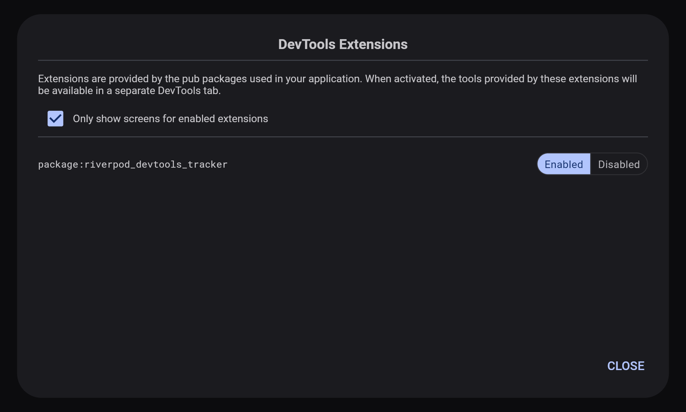
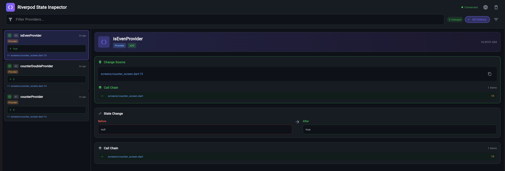
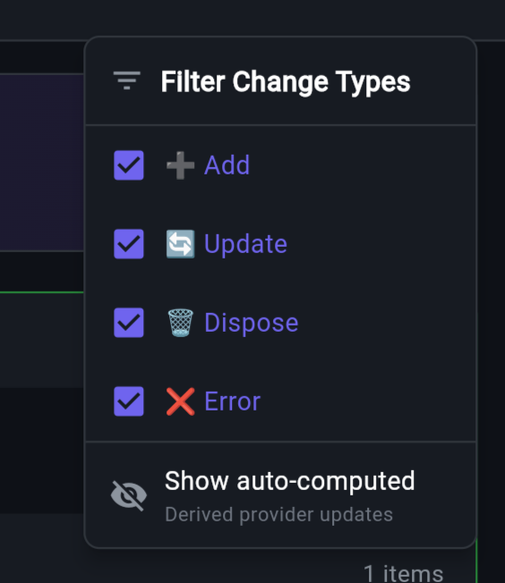
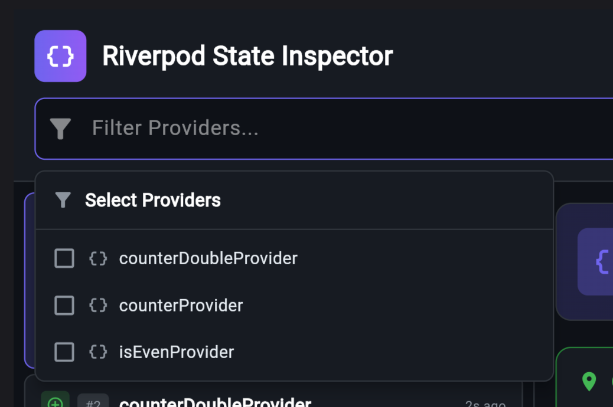

# Riverpod DevTools Tracker

[](https://pub.dev/packages/riverpod_devtools_tracker)
[](https://opensource.org/licenses/MIT)


[](https://pub.dev/packages/flutter_lints)

一個強大的 Flutter 套件，能自動追蹤 Riverpod 狀態變化並提供詳細的調用堆疊資訊，幫助你精確定位狀態變化的程式碼來源，讓除錯更輕鬆。

繁體中文 | **[English](README.md)**

## 目錄

- [功能特色](#功能特色)
- [安裝](#安裝)
- [快速開始](#快速開始)
- [如何使用 DevTools 擴展](#如何使用-devtools-擴展)
- [設定](#設定)
- [控制台輸出](#控制台輸出)
- [DevTools 擴展功能](#devtools-擴展功能)
- [疑難排解](#疑難排解)
- [系統需求](#系統需求)

## 功能特色

- 🔍 **自動狀態追蹤** - 無需手動編寫追蹤程式碼
- 📍 **程式碼位置偵測** - 精確顯示狀態變化的程式碼來源
- 📜 **調用鏈視覺化** - 查看完整的調用堆疊
- 🎨 **美觀的 DevTools 擴展** - GitHub 風格的暗色主題介面
- ⚡ **零配置** - 只需加入 observer 即可使用
- 🔧 **高度可配置** - 自訂追蹤內容和方式

## 安裝

### 步驟 1：加入套件

在 `pubspec.yaml` 中加入 `riverpod_devtools_tracker`：

```yaml
dependencies:
  flutter_riverpod: ^3.1.0  # 必要依賴
  riverpod_devtools_tracker: ^1.0.2
```

### 步驟 2：安裝依賴

在終端機中執行以下命令：

```bash
flutter pub get
```

這個套件包含兩個元件：
- **核心追蹤功能**：`RiverpodDevToolsObserver` 用於監聽和記錄狀態變化
- **DevTools 擴展**：視覺化介面，會自動被 Flutter DevTools 發現和載入

> **注意**：DevTools 擴展會自動包含在套件的 `extension/devtools/` 目錄中，不需要額外安裝或配置。

## 快速開始

### 步驟 1：引入套件

在你的 `main.dart` 檔案中引入套件：

```dart
import 'package:flutter/material.dart';
import 'package:flutter_riverpod/flutter_riverpod.dart';
import 'package:riverpod_devtools_tracker/riverpod_devtools_tracker.dart';
```

### 步驟 2：加入 Observer

將 `RiverpodDevToolsObserver` 加入到 `ProviderScope` 的 observers 列表中：

```dart
void main() {
  runApp(
    ProviderScope(
      observers: [
        RiverpodDevToolsObserver(
          config: TrackerConfig.forPackage('your_app_name'),  // 替換成你的套件名稱
        ),
      ],
      child: const MyApp(),
    ),
  );
}
```

> **重要**：將 `'your_app_name'` 替換成你在 `pubspec.yaml` 中的實際套件名稱（`name:` 欄位的值）

### 步驟 3：執行應用

```bash
flutter run
```

完成！現在當你執行應用並開啟 DevTools 時，就會看到 "Riverpod State Inspector" 標籤頁。

## 如何使用 DevTools 擴展

### 步驟 1：開啟 DevTools

執行應用後，有幾種方式可以開啟 Flutter DevTools：

**方法 A - 從 VS Code**
1. 執行你的應用（按 F5 或點擊 Run）
2. 點擊除錯工具列中的 **"Dart DevTools"** 按鈕
3. DevTools 會自動在瀏覽器中開啟

**方法 B - 從 Android Studio / IntelliJ**
1. 執行你的應用
2. 在 Run 面板中點擊 **"Open DevTools"**
3. DevTools 會自動在瀏覽器中開啟

**方法 C - 從命令列**
1. 執行你的應用：`flutter run`
2. 終端機會顯示 DevTools 網址：
   ```
   The Flutter DevTools debugger and profiler is available at:
   http://127.0.0.1:9100?uri=...
   ```
3. 點擊或複製該網址到瀏覽器中開啟

### 步驟 2：找到 Riverpod State Inspector 標籤頁

DevTools 開啟後：
1. 在頂部選單列中尋找 **"Riverpod State Inspector"** 標籤
2. 點擊該標籤開啟擴展介面



> **提示**：如果沒有看到這個標籤，請確認：
> - 套件已正確安裝且執行過 `flutter pub get`
> - `RiverpodDevToolsObserver` 已加入到 `ProviderScope`
> - 應用已重新啟動

### 步驟 3：了解介面佈局

DevTools 擴展採用雙欄式佈局：

**左側面板 - Provider 列表（400px 寬）**
- 按時間順序顯示所有狀態變化
- 每個項目顯示：
  - Provider 名稱和類型
  - 時間戳記
  - 變化類型（add/update/dispose/error）
  - 觸發變化的程式碼位置
- 點擊任何項目即可查看詳細資訊

**右側面板 - 狀態詳情**
- 顯示所選狀態變化的詳細資訊：
  - 變化前後的值對照
  - 完整的調用鏈與檔案位置
  - 調用堆疊中的函數名稱
  - 可點擊的檔案路徑（導航到程式碼）



### 步驟 4：追蹤和除錯狀態變化

當你與應用互動時：

1. **即時監控**：觀察左側面板即時更新顯示 provider 變化
2. **定位問題**：點擊任何變化記錄，查看觸發它的確切程式碼位置
3. **追蹤執行流程**：使用調用鏈了解程式執行路徑
4. **比對數值**：比較變化前後的值來除錯狀態問題

### 使用範例

假設你有一個 counter provider：

```dart
final counterProvider = StateProvider<int>((ref) => 0);

// 在你的 widget 中
ElevatedButton(
  onPressed: () => ref.read(counterProvider.notifier).state++,
  child: const Text('Increment'),
)
```

當你點擊按鈕時：
1. DevTools 擴展會立即顯示新項目：`UPDATE: counterProvider`
2. 位置會顯示按鈕被按下的確切位置（例如：`widgets/counter_button.dart:42`）
3. 點擊該項目可以看到數值從 `0` 變為 `1`
4. 調用鏈會顯示從按鈕點擊到狀態更新的完整路徑

## 設定

### 基本設定

```dart
RiverpodDevToolsObserver(
  config: TrackerConfig.forPackage(
    'your_app_name',
    enableConsoleOutput: true,      // 輸出到控制台
    prettyConsoleOutput: true,      // 使用美化格式輸出
    maxCallChainDepth: 10,          // 最大堆疊追蹤深度
    maxValueLength: 200,            // 最大值字串長度
  ),
)
```

### 進階設定

```dart
RiverpodDevToolsObserver(
  config: TrackerConfig(
    enabled: true,
    packagePrefixes: [
      'package:your_app/',
      'package:your_common_lib/',
    ],
    enableConsoleOutput: true,
    prettyConsoleOutput: true,
    maxCallChainDepth: 10,
    maxValueLength: 200,
    ignoredPackagePrefixes: [
      'package:flutter/',
      'package:flutter_riverpod/',
      'package:riverpod/',
      'dart:',
    ],
    ignoredFilePatterns: [
      'generated.dart',
      '.g.dart',
    ],
  ),
)
```

## 控制台輸出

當 `enableConsoleOutput` 設為 true 時，你會看到格式化的輸出：

```
╔══════════════════════════════════════════════════════
║ 🔄 UPDATE: counterProvider
║ ──────────────────────────────────────────────────────
║ 📍 Location: widgets/counter_button.dart:42 in _onPressed
║ ──────────────────────────────────────────────────────
║ 📜 Call chain:
║    → widgets/counter_button.dart:42 in _onPressed
║      providers/counter_provider.dart:15 in increment
║ ──────────────────────────────────────────────────────
║ Before: 0
║ After:  1
╚══════════════════════════════════════════════════════
```

## DevTools 擴展功能

擴展提供完整的除錯介面：

- **Provider 列表** - 即時查看所有狀態變化與時間戳記
- **位置資訊** - 顯示每個變化發生的確切檔案和行號
- **值比對** - 並排顯示變化前後的值，方便除錯
- **調用鏈** - 完整的調用堆疊，追蹤執行路徑
- **搜尋與過濾** - 快速找到特定的 provider 或變化
- **GitHub 風格暗色主題** - 長時間除錯也不傷眼

### Provider 狀態篩選

你可以透過搜尋框快速篩選特定的 Provider 狀態變化：



也可以專注於特定的 Provider 進行深入分析：



### 使用技巧

- **找出狀態 Bug**：查看調用鏈了解狀態為何意外變化
- **效能除錯**：檢查 provider 是否更新過於頻繁
- **程式碼導航**：點擊調用鏈中的檔案路徑跳轉到程式碼（如果你的 IDE 支援）
- **過濾**：使用 `packagePrefixes` 設定只專注於你應用的程式碼，過濾掉框架雜訊

## 疑難排解

### DevTools 擴展未顯示

如果你在 DevTools 中沒有看到 "Riverpod State Inspector" 標籤：

1. **確認 observer 已加入**：檢查 `RiverpodDevToolsObserver` 是否在 `ProviderScope` 的 observers 列表中
2. **重新建置應用**：加入套件後停止並重新啟動應用
3. **檢查 DevTools 版本**：確保使用最新版本的 DevTools
4. **驗證擴展已建置**：擴展應該在 `extension/devtools/` 目錄中

### 沒有狀態變化顯示

如果擴展可見但沒有狀態變化顯示：

1. **檢查 packagePrefixes**：確保你的應用套件名稱包含在設定中：
   ```dart
   TrackerConfig.forPackage('your_actual_package_name')
   ```
2. **驗證 provider 確實在變化**：試試簡單的計數器測試來確認追蹤是否運作
3. **檢查控制台輸出**：啟用 `enableConsoleOutput: true` 查看變化是否被追蹤到

### 調用鏈沒有顯示位置

如果你看到狀態變化但沒有檔案位置：

1. **套件名稱不符**：你的 `packagePrefixes` 可能與實際的套件結構不符
2. **所有位置都被過濾**：你的 `ignoredFilePatterns` 可能太過嚴格
3. **Provider 自動計算**：某些 provider 會根據依賴自動更新 - 這些不會有特定的觸發位置

### 效能問題

如果追蹤器拖慢你的應用：

1. **停用控制台輸出**：設定 `enableConsoleOutput: false` 以獲得更好的效能
2. **降低調用鏈深度**：將 `maxCallChainDepth` 降低到 5 或更少
3. **加入更多忽略模式**：過濾掉你不需要追蹤的高頻率更新 provider
4. **在正式版本中停用**：只在除錯模式使用追蹤器：
   ```dart
   observers: [
     if (kDebugMode) RiverpodDevToolsObserver(...)
   ]
   ```

## 系統需求

- Flutter SDK >= 3.27.0
- Dart SDK >= 3.7.0
- flutter_riverpod >= 3.1.0

## 授權

MIT License - 詳見 [LICENSE](LICENSE) 檔案。
